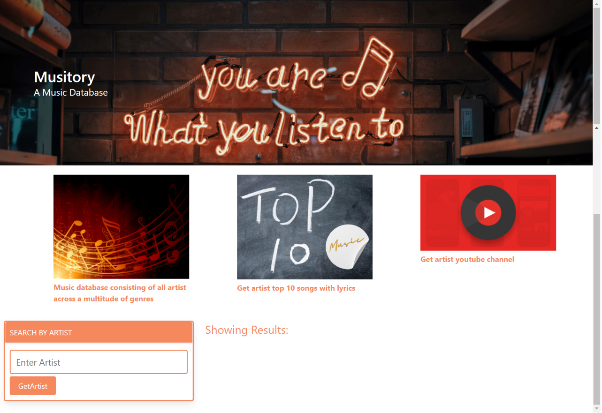

# Musitory - a music database app

* Application Link ------

Search Page:

## Description

<<<<<<< HEAD
* A music app that lets user search by artist and pull up their top 10 songs

* When a user clicks on a particular song of their top 10 choices 

* When a song choice is clicked, it opens up a new page where the song can play, lyrics gets displayed, brief story of the artist, and a search option for more

* When user clicks search option, youTube display is available

Additional description about the project and its Development

.

## Built With

- HTML 
- CSS
- JAVASCRIPT
- BULMA CSS Framework
- GENIUS API
- YOUTUBE API
- GITHUB 

## Live Demo

[Live Demo Link](./)

## Future Development

- Attached Youtube videos for the top songs results instead of random videos.
- More information on the artist. 
- Add extra functionality and a contact page.

=======
* A music app that lets a user choose any song by entering either a artist name, song title or song lyric using GeniusAPI.

* When searched the app will display  the top ten songs related to the search.

* When a song choice is clicked, it opens up a new page where the song can play, lyrics gets displayed, brief story of the artist, and a search option for more

* When user clicks search option, YouTube display related to the search term is available. 
>>>>>>> 73e79f608f3811736e9b22d460ba63129eb72415
